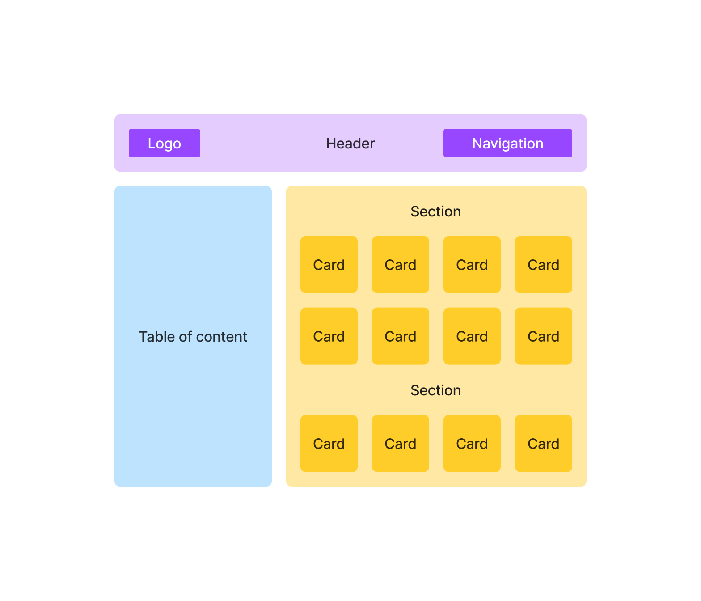

# Exercise: Mockup

## Instructions

-   Implement the mockup above using React.
-   Each card should have an image, a title, a description and a price.
-   The navigation component should be able to display a variable number
    of items.
-   The table of content should be able to display multiple levels of
    nested links using the `details` element.
-   Elements should use inline style when necessary.
-   Components should be re-usable; i.e. their content must not be
    hard-coded.
